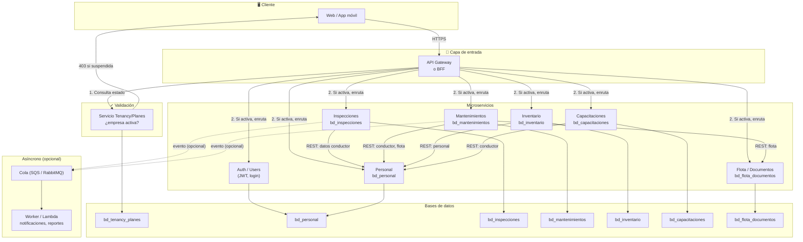
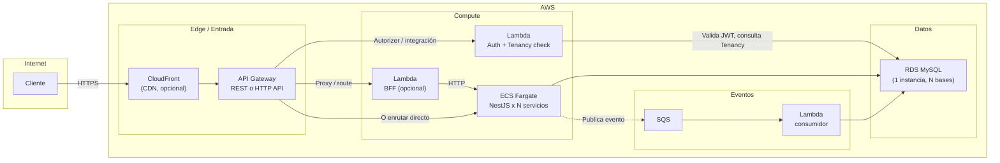
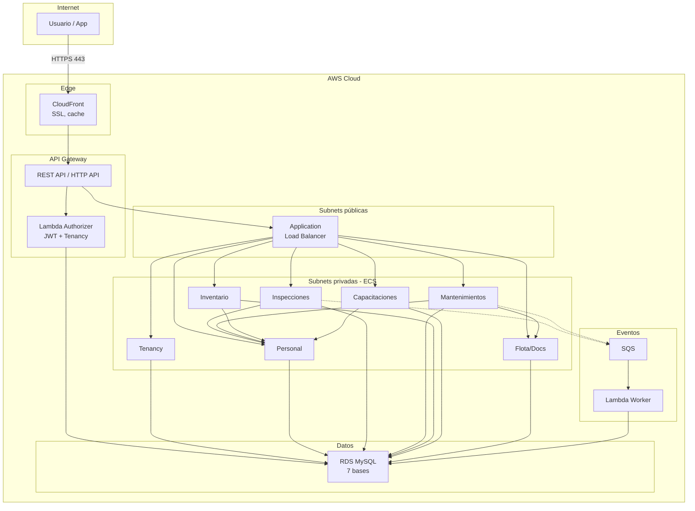

# Plan de trabajo: Microservicios y normalización QInspecting

## Resumen ejecutivo

Este documento define el plan para:
1. **Arquitectura de microservicios** desplegable en AWS, Render o Railway.
2. **Refactorización del backend** actual (NestJS monolito).
3. **Refactorización y normalización de bases de datos**: pasar de “una base por empresa” a **varias bases por sistema** (inspecciones, mantenimientos, inventario, capacitaciones, etc.), con **personal centralizado** en una sola tabla y sistemas que se comunican entre sí.
4. **Estrategia de planes y suspensión** por impago.

Incluye tiempos por fases y una **estrategia de bajo impacto** para minimizar riesgo operativo.

---

## 1. Estado actual

### 1.1 Backend

| Componente | Ubicación | Tecnología | Observación |
|------------|-----------|------------|-------------|
| **API principal** | `qinspecting_api_nest` (en `appears/`) | NestJS 11, TypeORM, MySQL, JWT, WebSockets | Monolito; una sola conexión por variable `DATABASE_NAME` (ej. `qinspect_newpruebas`). |

**Módulos actuales del API (por dominio):**
- Auth, Users, Permissions
- Preoperacional (inspecciones preoperacionales)
- Catálogos (ciudad, departamento, tipos vehículo, etc.)
- Vehículos (vehiculo, remolque, cabezote)
- Personal
- Firmas, Files
- Message WebSockets
- Data Migration (ya preparado para migrar a esquema normalizado)

La aplicación **no** está en este repo; este repo solo contiene los dumps SQL (`bases_qinspecting`).

### 1.2 Bases de datos actuales (dumps en `bases_qinspecting`)

| Base | Archivo | Rol | Tablas aprox. |
|------|---------|-----|----------------|
| **qinspect_planesQi** | `qinspect_planesQi.sql` | Maestro: empresas, empleados (QI), planes, Planes_empresas, mensajes. Campo `Empresas.base` indica la base por empresa. | 5 |
| **qinspect_newdistransllano** | `qinspect_newdistransllano.sql` | Una base por empresa (cliente) | ~165 |
| **qinspect_newriano** | `qinspect_newriano.sql` | Idem | ~162 |
| **qinspect_newtmc** | `qinspect_newtmc.sql` | Idem | ~166 |
| **qinspect_newpruebas** | `qinspect_newpruebas.sql` | Pruebas; incluye más tablas (alertas mantenimiento, llantas, programación mtto, etc.) | ~222 |

**Problemas actuales:**
- **Una base por empresa**: escalado costoso, operación compleja, backups y mantenimiento por cliente.
- **Personal duplicado**: en cada base “new*” hay tablas `personal` / `Personal` (legacy con triggers) y datos de personal por empresa; en `qinspect_planesQi` hay `Empleados` (empleados de QI).
- **Empresa duplicada**: en cada base “new*” existe `empresa` / `Empresa` (réplica por cliente).
- **Mezcla de dominios**: en una misma base conviven inspecciones, mantenimiento, inventario, capacitación, documentos, encuestas, etc., lo que dificulta escalar por dominio y desplegar por sistema.
- **Inconsistencias de esquema**: tablas en PascalCase y camelCase, triggers legacy (`Personal` → `personal`), diferencias entre bases (pruebas tiene más tablas).

### 1.3 Trabajo previo útil

- **data-migration.config.ts** en `qinspecting_api_nest`: define mapeo origen → destino con **prefijos por dominio** (cat*, per*, man*, veh*, cap*, inv*, doc*, insp*, lla*, preop*, prov*, emp*, enc*, fes*, prog*) y orden de migración por niveles. El target ya se llama `qinspect_normalizado`. Se puede reutilizar como base para el esquema normalizado por sistema.

---

## 2. Arquitectura objetivo

### 2.1 Modelo de datos: bases por sistema

Objetivo: **varias bases según sistema**, no una por empresa. Todas comparten un **identificador de empresa (tenant)** para multi-tenancy.

| Base / Sistema | Contenido principal | Quién la usa |
|----------------|---------------------|--------------|
| **bd_tenancy_planes** | Empresas, planes, Planes_empresas, estado de pago, mensajes sistema. Fuente de verdad para “¿puede esta empresa usar el sistema?”. | Gateway / BFF / todos los servicios |
| **bd_personal** | Una sola tabla (o conjunto normalizado) de **personal** con `id_empresa`; catálogos compartidos (cargos, tipo documento, ciudad, etc.). Fuente de verdad de personas. | Servicio de Personal; otros servicios solo referencian por ID o consultan vía API |
| **bd_inspecciones** | Inspecciones (preoperacional, ítems, adjuntos, llantas, formatos especiales, etc.). Referencias a `id_empresa` y `id_personal` (o documento). | Microservicio Inspecciones |
| **bd_mantenimientos** | Órdenes de servicio, rutinas, programación mtto, fallas, ejecutores, etc. | Microservicio Mantenimientos |
| **bd_inventario** | Almacenes, entradas/salidas, traslados, solicitudes, inventario por vehículo, etc. | Microservicio Inventario |
| **bd_capacitaciones** | Capacitaciones, preguntas, respuestas, evidencias, cursos certificados por conductor, etc. | Microservicio Capacitaciones |
| **bd_flota_documentos** | Vehículos, remolques, cabezotes, documentos flota, documentos conductor, firmas. Opcional: separar “flota” y “documentos” si el equipo prefiere. | Microservicio Flota / Documentos |
| **bd_catalogos_compartidos** (opcional) | Si se desea un solo lugar para ciudad, departamento, tipos vehículo, etc., para no duplicar en cada BD. Alternativa: repetir catálogos mínimos por base y sincronizar desde un “servicio de catálogos”. | Servicio Catálogos o cada dominio |

La **comunicación entre sistemas** se hace por:
- **APIs REST/HTTP** entre microservicios (ej. Inspecciones llama a Personal para validar conductor).
- Opcional: **eventos** (colas SQS/RabbitMQ) para procesos asíncronos (ej. “inspección cerrada” → notificación o reporte).

### 2.2 Personal centralizado

- **Una sola tabla (o esquema) de personal** en `bd_personal`, con `id_empresa` en cada registro.
- Los demás sistemas (**inspecciones, mantenimientos, inventario, capacitaciones**) no duplican datos de personal; guardan `id_personal` o `numero_documento` + `id_empresa` y consultan al **Servicio de Personal** cuando necesitan nombres, cargo, etc.
- Migración: desde cada base `qinspect_new*` se extrae `personal` y se consolidan en `bd_personal` con un `id_empresa` que venga del maestro (qinspect_planesQi: `Empresas` + relación con la base actual). Deduplicación por (numero_documento, id_empresa).

### 2.3 Estrategia de planes y suspensión por impago

- **Fuente de verdad**: tablas en `bd_tenancy_planes` (evolución de `qinspect_planesQi`):
  - `empresas` (id, razon_social, base_legacy, estado, etc.)
  - `planes` (límites: vehículos, inspecciones, capacitaciones, etc.)
  - `planes_empresas` (id_empresa, id_plan, fecha_inicio, fecha_facturacion, **estado_pago**, **vigente_hasta**)
- **Estados de suscripción**: por ejemplo `activo | vencido | suspendido | cancelado`.
- **Lógica**:
  - Un job o proceso externo (cobranza/facturación) actualiza `estado_pago` y `vigente_hasta`.
  - Si no hay pago a tiempo → estado `suspendido` (o `vencido`).
- **Aplicación**:
  - **API Gateway o BFF**: antes de enrutar a cualquier microservicio, consulta “¿esta empresa está activa?”. Si está suspendida, responde 403 y mensaje “Servicio suspendido por falta de pago”.
  - Alternativa: **middleware en cada servicio** que reciba `id_empresa` (o tenant) en token/header y consulte al **Servicio de Tenancy/Planes**; si no está activa, rechaza la petición.
- Así se puede **suspender el servicio por empresa** sin tocar otras.

---

## 3. Refactorización de bases de datos

### 3.1 Normalización y convenciones

- **Un solo esquema normalizado** por base (nombres consistentes, prefijos por dominio como en `data-migration.config.ts`).
- **Eliminar duplicados**: una sola tabla de personal; una sola fuente de empresas/planes en tenancy.
- **id_empresa (tenant)** en todas las tablas transaccionales que lo requieran.
- **Eliminar** tablas legacy duplicadas (`Personal`/`personal`, `Empresa`/`empresa`) y triggers de sincronización una vez migrado.
- **Charset**: `utf8mb4` y collation consistente en todas las bases.

### 3.2 Esquema sugerido por sistema (resumen)

- **bd_tenancy_planes**: empresas, planes, planes_empresas (con estado_pago, vigente_hasta), mensajes.
- **bd_personal**: personal (id, id_empresa, numero_documento, nombres, apellidos, ...), catálogos: cargos, tipo_documento, ciudad, departamento, area, etc.
- **bd_inspecciones**: tablas con prefijo insp/preop/lla/fes según `data-migration.config`; todas con `id_empresa`.
- **bd_mantenimientos**: man*, prog*, ejm*; `id_empresa` donde aplique.
- **bd_inventario**: inv*; `id_empresa`.
- **bd_capacitaciones**: cap*; `id_empresa`.
- **bd_flota_documentos**: veh*, doc*; `id_empresa`.

Las FK “entre bases” no existen a nivel SQL; la consistencia se mantiene por aplicación (IDs y validaciones en servicios).

### 3.3 Migración de datos

- **Orden**:
  1. Crear nuevas bases y esquemas (DDL) en el motor elegido (MySQL/Postgres según decisión).
  2. **bd_tenancy_planes**: migrar desde `qinspect_planesQi` y extender con columnas de estado de pago/vigencia.
  3. **bd_personal**: para cada base `qinspect_new*`, extraer `personal` y cargar en bd_personal asignando `id_empresa` (mapeo por nombre de base → Empresas en planesQi). Deduplicar por (numero_documento, id_empresa).
  4. Catálogos: migrar desde una base “origen” (ej. newpruebas) a bd_catalogos_compartidos o a cada BD de sistema según diseño.
  5. Por cada sistema (inspecciones, mantenimiento, inventario, capacitaciones, flota): migrar tablas desde cada `qinspect_new*` hacia la BD del sistema, inyectando `id_empresa` en cada fila (mapeo base → id_empresa).
- **Herramientas**: reutilizar y extender el **DataMigrationService** y `data-migration.config` del Nest actual; añadir mapeo base → id_empresa desde qinspect_planesQi.

---

## 4. Refactorización del backend (microservicios)

### 4.1 Opciones de descomposición

**Opción A – Monolito modular primero (recomendada para bajo impacto)**  
- Mantener un solo repositorio (o monorepo) con un solo deployable que ya use **varias conexiones TypeORM** (una por “sistema”): tenancy, personal, inspecciones, mantenimientos, inventario, capacitaciones, flota.
- Cada “módulo” del Nest (Personal, Preoperacional, etc.) se conecta solo a la conexión que le corresponde.
- Ventaja: un solo despliegue, menos cambios de infra; después se pueden extraer servicios a procesos separados.

**Opción B – Microservicios desde el inicio**  
- Un repositorio por servicio (o monorepo con N aplicaciones Nest).
- Cada servicio: su propia BD, su API REST, despliegue independiente en AWS/Render/Railway.
- Un **API Gateway** (o BFF) que enruta por path o subdominio (ej. `api.qinspecting.com/inspecciones`, `api.qinspecting.com/personal`) y que **consulta tenancy** antes de reenviar (suspensión por impago).

Recomendación: **Fase 1 con Opción A** (monolito con múltiples BDs y módulos bien acotados), **Fase 2** extraer a servicios independientes (Opción B) cuando la migración de datos y la normalización estén estables.

### 4.2 Servicios objetivo (cuando se extraigan)

| Servicio | Responsabilidad | Base de datos |
|----------|-----------------|---------------|
| **Tenancy / Planes** | Empresas, planes, estado de pago, mensajes; endpoint “¿empresa X está activa?” | bd_tenancy_planes |
| **Personal** | CRUD personal, catálogos de cargos/tipo doc/ciudad; usado por otros servicios | bd_personal |
| **Inspecciones** | Preoperacional, ítems inspección, adjuntos, llantas, formatos especiales | bd_inspecciones |
| **Mantenimientos** | Órdenes de servicio, programación, rutinas, fallas, ejecutores | bd_mantenimientos |
| **Inventario** | Almacenes, movimientos, traslados, solicitudes | bd_inventario |
| **Capacitaciones** | Cursos, preguntas, respuestas, evidencias, certificados por conductor | bd_capacitaciones |
| **Flota / Documentos** | Vehículos, remolques, documentos, firmas | bd_flota_documentos |
| **Catálogos** (opcional) | Catálogos compartidos si no están embebidos en cada BD | bd_catalogos_compartidos |
| **Auth / Users** | Login, JWT, usuarios (vinculados a personal); puede vivir en un BFF o en servicio compartido | bd_personal o bd_tenancy (según diseño) |

### 4.3 Comunicación entre servicios

- **Síncrona**: REST/HTTP (ej. Inspecciones llama a Personal para obtener nombre del conductor).
- **Autenticación entre servicios**: API keys, JWT interno o mTLS según plataforma (AWS/Render/Railway).
- **Tenancy**: en cada request se pasa `id_empresa` (o tenant) en JWT o header; el Gateway o cada servicio valida contra Tenancy antes de procesar.

### 4.4 Despliegue en AWS, Render o Railway

- **Render / Railway**: cada servicio = un “service” que apunta al mismo repo (monorepo) o a repos separados; variables de entorno por servicio (DATABASE_URL de su BD). Gateway como otro service que enruta a los demás.
- **AWS**: ECS Fargate o EKS por servicio; RDS (o Aurora) por base; ALB/API Gateway delante. Alternativa: Lambda + API Gateway si se opta por serverless por servicio.
- **Bases de datos**: MySQL/Postgres gestionado (RDS, Render DB, Railway Postgres). Mantener una instancia por “sistema” o un cluster con varias bases según oferta del proveedor.

---

## 5. Plan de trabajo por fases y tiempos

Estimación en **semanas** (equipo pequeño 1–2 devs; ajustar si hay más gente).

| Fase | Descripción | Duración | Entregables |
|------|-------------|----------|-------------|
| **0** | Análisis y diseño detallado | 2–3 sem | Documento de esquemas DDL por base, mapeo tabla-origen → tabla-destino por sistema, decisión AWS/Render/Railway, diseño API entre servicios. |
| **1** | Normalización y bases por sistema | 4–6 sem | DDL de bd_tenancy_planes, bd_personal, bd_inspecciones, bd_mantenimientos, bd_inventario, bd_capacitaciones, bd_flota_documentos. Scripts de migración de datos desde dumps actuales (y desde BD vivo si aplica). Pruebas de integridad (conteos, muestreos). |
| **2** | Refactor API: multi-database y módulos | 4–6 sem | Nest con múltiples DataSource (una por sistema). Módulos que usen solo su conexión. Sin extraer aún a procesos separados. Auth/tenancy: middleware o guard que consulte “estado empresa” y rechace si está suspendida. |
| **3** | Estrategia de planes y suspensión | 2–3 sem | Modelo de datos en bd_tenancy_planes (estado_pago, vigente_hasta). Job o proceso que marque vencidos/suspendidos. Gateway o middleware que bloquee acceso por empresa suspendida. Mensaje claro al usuario (“Servicio suspendido por falta de pago”). |
| **4** | Descomposición en microservicios (opcional) | 6–8 sem | Extraer cada dominio a servicio independiente. API Gateway o BFF. Comunicación HTTP entre servicios. Despliegue por servicio en la nube elegida. |
| **5** | Despliegue y migración en producción | 3–4 sem | Entornos (staging/prod), CI/CD por servicio o monolito, migración de datos en ventana de mantenimiento, rollback plan. |

**Total estimado (sin descomposición completa):** ~15–22 sem (~4–5,5 meses).  
**Con descomposición en microservicios:** ~21–30 sem (~5–7,5 meses).

---

## 6. Estrategia para minimizar impacto

1. **Strangler Fig**
   - Mantener la API actual sirviendo tráfico.
   - Nuevos endpoints (o misma ruta con feature-flag) que lean/escriban en las nuevas bases por sistema.
   - Ir moviendo clientes (o empresas) de “modo legacy” a “modo nuevo” por etapas.

2. **Doble lectura/escritura temporal (opcional)**
   - Durante la migración, escribir en base antigua y en la nueva (por sistema) para comparar y validar.
   - Cuando todo esté validado, cortar escritura a la base antigua y leer solo de la nueva.

3. **Feature flags por empresa**
   - Flag “usa_bases_por_sistema” por empresa. Solo las empresas con el flag en true usan el nuevo modelo; el resto sigue en “una base por empresa” hasta que se migren.

4. **Ventanas de migración**
   - Migración de datos en ventanas de bajo uso (noches/fines de semana).
   - Primero una empresa piloto (ej. la de pruebas), luego el resto.

5. **Rollback**
   - Poder volver a apuntar la API a la base “por empresa” si algo falla (mantener bases legacy hasta confirmar estabilidad).
   - Rollback por empresa si se usa feature flag.

6. **Personal centralizado**
   - Migrar primero bd_personal y que el API lea personal desde ahí (con fallback a tabla en base legacy si hace falta) antes de migrar el resto de dominios.

---

## 7. Próximos pasos inmediatos

1. **Confirmar** que no hay más backends de qinspecting fuera de `qinspecting_api_nest` (y si los hay, incorporarlos al plan).
2. **Definir** proveedor principal de despliegue (AWS vs Render vs Railway) y si la primera entreña será monolito multi-BD o microservicios desde el inicio.
3. **Fijar** empresa piloto y ventana de migración para la primera base por sistema (recomendado: bd_tenancy_planes + bd_personal).
4. **Documentar** en detalle el DDL de `bd_tenancy_planes` (incluyendo campos de estado de pago y vigencia) y el flujo exacto de “suspensión por impago” (quién actualiza, cada cuánto, mensaje al usuario).
5. **Reutilizar** `data-migration.config.ts` y DataMigrationService para generar scripts de migración por sistema y ejecutar primero en copia de las bases actuales.

---

## 8. Resumen de decisiones a tomar

| Tema | Opciones | Recomendación |
|------|----------|----------------|
| Primera entreña | Monolito multi-BD vs microservicios | Monolito multi-BD (menor riesgo). |
| Catálogos | Una BD compartida vs repetir por sistema | Una BD compartida o servicio Catálogos para no duplicar. |
| Auth/usuarios | En Tenancy vs en Personal | Personal (usuarios ligados a personal); Tenancy solo “¿puede usar el sistema?”. |
| Despliegue | AWS / Render / Railway | Decidir según coste y experiencia del equipo; Render/Railway aceleran el inicio. |
| Motor de BD | MySQL vs Postgres | Mantener MySQL si ya está en producción; Postgres si se prefiere para nuevos desarrollos. |

---

## 9. Desarrollos personalizados por empresa

### 9.1 ¿Qué tan recomendable es?

**Es recomendable** siempre que se haga con **reglas claras** y una **arquitectura preparada**. Permite:

- **Ingresos**: cobrar por funcionalidades exclusivas y luego ofrecerlas al resto.
- **Fidelización**: clientes grandes suelen pedir ajustes; tener un camino definido evita “parches” descontrolados.
- **Innovación**: probar ideas con un cliente antes de llevarlas al producto estándar.

El riesgo no es abrir la posibilidad, sino hacerlo **sin criterio** (código duplicado por cliente, ramas infinitas, lógica con `if (empresa === 'X')` por todo el código).

### 9.2 Impacto según cómo se implemente

| Enfoque | Impacto en código | Impacto en BD | Mantenimiento | Riesgo |
|--------|--------------------|---------------|----------------|--------|
| **if (id_empresa === X)** repartido por el código | Alto: lógica dispersa, difícil de testear | Bajo | Muy alto: cada cambio toca muchos sitios | Alto |
| **Feature flags por empresa** (ej. “tiene_reporte_llantas_avanzado”) | Medio: flags en configuración, lógica en un solo lugar | Bajo (a veces una tabla de config) | Medio | Bajo |
| **Módulos/plugins por tenant** (código separado, registrado por empresa) | Bajo: código aislado en carpetas o paquetes | Medio si hay tablas “extensibles” o por tenant | Bajo si está bien acotado | Bajo |
| **Extensiones en BD** (columnas/tablas opcionales activadas por empresa) | Bajo si la app las usa vía abstracción | Medio: más tablas o columnas nullable | Medio | Medio |

Recomendación: **combinar feature flags por empresa + módulos/plugins** para funcionalidades grandes. Así una función nace “solo para la empresa A” pero desde el día uno está pensada para activarse también en B, C, etc.

### 9.3 Conveniencia: flujo “una empresa → luego todos”

- **Fase 1 (solo una empresa)**  
  - La función se desarrolla como **módulo o plugin** activable por **feature flag** o **capacidad** ligada a `id_empresa` (en `bd_tenancy_planes`: tabla `empresa_capacidades` o `empresa_features`).
  - El código vive en el mismo repo (carpeta tipo `features/avanzado-llantas/` o `plugins/reporte-llantas/`) y **solo se ejecuta** si la empresa tiene esa capacidad.
  - No se usan `if (razon_social === 'X')` en el core; solo “¿esta empresa tiene la capacidad Y?”.

- **Fase 2 (incluirla para todos)**  
  - Se añade la capacidad al **plan** (ej. plan “Premium” incluye “reporte llantas avanzado”) o se activa para todos.
  - Mismo código, solo cambia la configuración (qué empresas o planes tienen la capacidad).
  - Opcional: mover el feature de “plugin” a **core** del producto y quitar el flag cuando ya sea estándar.

Ventaja: **un solo código**, un solo despliegue; la personalización es **configuración + capacidades**, no ramas por cliente.

### 9.4 Qué incorporar en la arquitectura desde ya

Para que los desarrollos por empresa tengan bajo impacto y sean fáciles de “promocionar” al resto:

1. **Tabla de capacidades por empresa (o por plan)**  
   En `bd_tenancy_planes`, algo como:
   - `empresa_capacidades` (id_empresa, codigo_capacidad, activo, fecha_desde, fecha_hasta)  
   o que el plan incluya un conjunto de capacidades y la empresa herede las de su plan más “extras” por empresa.
   - Ejemplos de `codigo_capacidad`: `reporte_llantas_avanzado`, `alertas_mtto_custom`, `integracion_erp`, etc.

2. **Servicio o middleware “Capacidades”**  
   - Que exponga “¿la empresa X tiene la capacidad Y?” (usado por Gateway, BFF o por cada servicio).
   - El backend decide si exponer una ruta o un comportamiento según esa respuesta, **sin hardcodear** nombres de empresas.

3. **Código de features “por empresa” en carpetas acotadas**  
   - Por ejemplo `src/features/` o `src/plugins/`, cada uno con su módulo Nest, sus controladores y su lógica.
   - Registrar rutas o comportamientos solo si la empresa tiene la capacidad; así no se mezcla con el core.

4. **Base de datos**  
   - **Preferible**: funcionalidades nuevas usan las mismas bases por sistema (inspecciones, mantenimientos, etc.) con `id_empresa` y, si hace falta, tablas o columnas **opcionales** (ej. tabla `insp_config_avanzada_llantas` que solo usan quienes tienen la capacidad).
   - Evitar una base distinta por empresa solo para “custom”; eso vuelve al modelo que se quiere dejar atrás.

5. **Contratos y proceso**  
   - Definir con el cliente que lo “personalizado” puede convertirse en oferta estándar (para otros) y bajo qué condiciones (precio, soporte, SLA).
   - En código: documentar cada capacidad, qué hace y qué empresas la tienen, para poder revisar qué “promocionar” a plan estándar.

### 9.5 Resumen: impacto y conveniencia

| Pregunta | Respuesta |
|----------|-----------|
| **¿Es recomendable?** | Sí, si se hace con capacidades por empresa/plan, código en módulos/plugins y sin ramas por nombre de cliente. |
| **¿Qué impacto tiene?** | Bajo si desde el inicio hay tabla de capacidades, middleware de capacidades y código de custom en carpetas acotadas; alto si se usa `if (empresa === X)` repartido. |
| **¿Qué tan conveniente es?** | Muy conveniente para negocio (cobro por custom, fidelización, pruebas con un cliente) y para producto (un solo código, promoción a “todos” solo cambiando configuración). |
| **¿Cuándo no hacerlo?** | Si no se está dispuesto a mantener una capa de “capacidades” y a aislar el código custom; en ese caso es mejor rechazar el desarrollo o ofrecerlo solo como proyecto aparte (integración vía API externa). |

---

## 10. Diagrama de comunicaciones entre microservicios

Esta sección describe el flujo de una petición desde el cliente hasta los microservicios y las **tecnologías** que intervienen en cada capa. Se plantean dos variantes: **AWS** (API Gateway, Lambda, ECS, RDS, SQS) y **Render/Railway** (BFF + servicios contenedorizados).

### 10.1 Flujo general (capas)

```
[Cliente Web/App]
       │
       ▼
[API Gateway / BFF]  ← valida JWT, extrae id_empresa
       │
       ├──► [Tenancy/Planes]  ← "¿empresa activa?" → si no → 403
       │
       ▼ (si activa)
[Enrutado por path o subdominio]
       │
       ├──► Auth/Login        → (opcional) Lambda / servicio Auth
       ├──► Personal          → NestJS + bd_personal
       ├──► Inspecciones      → NestJS + bd_inspecciones  ──► llama a Personal (REST)
       ├──► Mantenimientos    → NestJS + bd_mantenimientos ──► llama a Personal, Flota (REST)
       ├──► Inventario        → NestJS + bd_inventario     ──► llama a Personal (REST)
       ├──► Capacitaciones    → NestJS + bd_capacitaciones ──► llama a Personal (REST)
       └──► Flota/Documentos  → NestJS + bd_flota_documentos
```

### 10.2 Diagrama Mermaid – Comunicaciones (vista lógica)



### 10.3 Diagrama Mermaid – Tecnologías AWS (ejemplo concreto)



**Leyenda tecnologías AWS:**

| Capa | Tecnología | Rol |
|------|------------|-----|
| **Entrada** | **CloudFront** | CDN, cache, HTTPS terminator (opcional). |
| **API** | **API Gateway** (REST o HTTP API) | Punto único de entrada, throttling, CORS, autorizadores (Lambda authorizer para JWT y consulta Tenancy). |
| **Auth/Tenancy** | **Lambda** (Authorizer + posible BFF) | Valida JWT, extrae `id_empresa`, llama a Tenancy “¿activa?”; si no → 403. Opcional: BFF en Lambda que agregue llamadas a varios servicios. |
| **Microservicios** | **ECS Fargate** (o EKS, o Lambda por servicio) | Contenedores NestJS, uno por dominio (Personal, Inspecciones, Mantenimientos, etc.). Cada uno con su DATABASE_URL (misma RDS, bases distintas). |
| **Bases de datos** | **RDS MySQL** (o Aurora) | Una instancia/cluster; varias bases (bd_tenancy_planes, bd_personal, bd_inspecciones, …). |
| **Asíncrono** | **SQS** + **Lambda** | Cola para eventos (ej. “inspección cerrada”, “orden mtto cerrada”); Lambda consume y envía notificaciones o genera reportes. |
| **Secrets** | **Secrets Manager** o **Parameter Store** | Credenciales BD, JWT secret, API keys entre servicios. |

### 10.4 Orden sugerido de tecnologías en una petición (AWS)

1. **Cliente** → HTTPS → **CloudFront** (opcional).  
2. **CloudFront** → **API Gateway** (REST/HTTP API).  
3. **API Gateway** → **Lambda Authorizer**: valida JWT, extrae `id_empresa`, llama a **Tenancy** (otra Lambda o ECS) o lee de **RDS** (bd_tenancy_planes); devuelve política IAM/allow/deny.  
4. Si **allow**: **API Gateway** enruta por path (ej. `/personal/*`, `/inspecciones/*`) a:  
   - **Integración HTTP** → ALB → **ECS** (servicio NestJS correspondiente), o  
   - **Lambda BFF** que hace varias llamadas HTTP a ECS y agrega respuesta.  
5. **Servicio ECS** (ej. Inspecciones) → lee/escribe en **RDS** (bd_inspecciones); si necesita datos de conductor → llama por **HTTP** al servicio **Personal** (ECS o Lambda).  
6. (Opcional) Servicio publica mensaje a **SQS** → **Lambda** consumidora → notificaciones o reportes.

### 10.5 Variante Render / Railway (sin API Gateway AWS)

- **BFF o Gateway**: un **servicio NestJS** (o Express) desplegado como Web Service que recibe todo el tráfico, valida JWT, consulta Tenancy (otro servicio o misma app), y hace **proxy** o **llamadas internas** a los demás servicios.  
- **Servicios**: cada dominio = un **Web Service** (contenedor) con su `DATABASE_URL`.  
- **Bases de datos**: **Render PostgreSQL/MySQL** o **Railway PostgreSQL/MySQL** (una base por sistema).  
- **Colas**: **Render Redis** o **Railway** add-on para colas; o servicio worker en el mismo stack que consuma desde Redis/DB.  

No hay “API Gateway” ni “Lambda” como en AWS; la capa de entrada y la lógica de tenancy viven en el **BFF** o en un **servicio Gateway** contenedorizado.

### 10.6 Resumen: tecnologías que intervienen

| Orden | Componente | Tecnología (AWS) | Tecnología (Render/Railway) |
|-------|------------|------------------|-----------------------------|
| 1 | Entrada única | API Gateway (REST/HTTP API) | BFF NestJS (Web Service) |
| 2 | Auth + Tenancy | Lambda Authorizer + Lambda/ECS Tenancy | Middleware en BFF + servicio Tenancy o mismo BFF |
| 3 | Enrutado | API Gateway routes → integración HTTP/ALB | BFF proxy o llamadas HTTP internas a servicios |
| 4 | Microservicios | ECS Fargate (NestJS) o Lambda por dominio | Web Services (NestJS), uno por dominio |
| 5 | Bases de datos | RDS MySQL (varias bases) | Render DB / Railway MySQL o Postgres (una por sistema) |
| 6 | Comunicación servicio–servicio | HTTP/REST (ALB interno o Service Connect) | HTTP/REST (URL interna entre servicios) |
| 7 | Eventos asíncronos | SQS + Lambda | Redis + Worker o cola gestionada |
| 8 | Secrets | Secrets Manager / Parameter Store | Variables de entorno del servicio |

---

## 11. Arquitectura AWS al detalle

Esta sección detalla **solo AWS**: componentes, configuración sugerida y flujo de una petición de punta a punta. Para **plantillas SAM, código del Lambda Authorizer y configuración de rutas de API Gateway**, ver el documento y los archivos en **[arquitectura_aws/](arquitectura_aws/README.md)**.

### 11.1 Vista de arquitectura AWS (diagrama)



### 11.2 VPC y redes

| Elemento | Recomendación |
|----------|----------------|
| **VPC** | Una VPC por entorno (prod, staging). CIDR ej. `10.0.0.0/16`. |
| **Subnets públicas** | 2+ AZ (ej. `10.0.1.0/24`, `10.0.2.0/24`). ALB, NAT Gateway. |
| **Subnets privadas** | 2+ AZ. ECS tasks. |
| **Subnets RDS** | Mismo par de privadas o subnet group dedicado en 2 AZ. |
| **NAT Gateway** | En públicas; tareas ECS en privadas lo usan para salida (npm, SQS, APIs externas). |

API Gateway es gestionado (fuera de VPC); se integra con el ALB por HTTP (ALB con IP públicas o VPC Link si ALB es interno).

### 11.3 API Gateway

| Aspecto | Configuración |
|---------|----------------|
| **Tipo** | REST API o HTTP API (HTTP API más barato). |
| **Rutas** | `/{proxy+}` por contexto: `/personal/{proxy+}`, `/inspecciones/{proxy+}`, `/mantenimientos/{proxy+}`, `/inventario/{proxy+}`, `/capacitaciones/{proxy+}`, `/flota/{proxy+}`, `/auth/login`, `/auth/refresh`. |
| **Autorizador** | Lambda Authorizer (REQUEST). Recibe header Authorization, valida JWT, consulta Tenancy en RDS; devuelve Allow/Deny + context (`id_empresa`). |
| **Excepciones** | `/auth/login` y `/auth/refresh` sin authorizer (aún no hay token). |
| **Integración** | HTTP integration a la URL del ALB; reenviar path y query; inyectar header `X-Id-Empresa` desde context del authorizer. |
| **Throttling** | Límites por etapa; opcional usage plans. |

### 11.4 Lambda Authorizer (Auth + Tenancy)

- **Runtime:** Node.js 20.x.
- **Entrada:** evento API Gateway (header `Authorization`). Extraer Bearer token.
- **Lógica:** (1) Sin token → Deny. (2) Verificar JWT (secret en Secrets Manager). (3) Consultar RDS `bd_tenancy_planes`: estado de la empresa (estado_pago, vigente_hasta). (4) Si suspendida/vencida → Deny (403). (5) Si OK → Allow + context `{ id_empresa }`.
- **RDS:** Lambda en VPC (mismas subnets que RDS) o usar RDS Data API / servicio Tenancy en ECS que consulte RDS.
- **Secrets:** JWT secret y conexión RDS en Secrets Manager; rol IAM con `secretsmanager:GetSecretValue`.

### 11.5 Application Load Balancer (ALB)

- **Listeners:** HTTPS 443 (certificado ACM). Reglas por path:
  - `/personal*` → target group Personal
  - `/inspecciones*` → Inspecciones
  - `/mantenimientos*` → Mantenimientos
  - `/inventario*` → Inventario
  - `/capacitaciones*` → Capacitaciones
  - `/flota*` → Flota
  - `/auth*` → Auth/Tenancy
- **Target groups:** tipo IP (Fargate); puerto 3000; health check `/health`.

### 11.6 ECS Fargate

| Concepto | Configuración |
|----------|----------------|
| **Cluster** | Un cluster por entorno. |
| **Task definition** | Una por servicio. Imagen ECR (NestJS). Env: `DATABASE_URL` (Secrets Manager), `NODE_ENV`, `SERVICE_NAME`. Logs → CloudWatch. |
| **Servicios** | 7 servicios: tenancy, personal, inspecciones, mantenimientos, inventario, capacitaciones, flota. Cada uno con su target group, 1+ tareas, rolling deployment. |
| **Comunicación entre servicios** | URL del ALB; ej. `PERSONAL_SERVICE_URL=http://ALB/personal`. Inspecciones llama a Personal vía HTTP al ALB. |
| **IAM (task role)** | Secrets Manager, CloudWatch Logs, SQS SendMessage (si publican eventos). |

### 11.7 RDS MySQL

- **Motor:** MySQL 8.x (o Aurora MySQL).
- **Una instancia** por entorno; 7 bases: `bd_tenancy_planes`, `bd_personal`, `bd_inspecciones`, `bd_mantenimientos`, `bd_inventario`, `bd_capacitaciones`, `bd_flota_documentos` (DDL de refactor_ddl).
- **Security group:** puerto 3306 solo desde security group de ECS (y de Lambda si Lambda en VPC accede a RDS).
- **Secrets Manager:** credenciales RDS (creadas por RDS al crear instancia).

### 11.8 SQS y Lambda worker

- **Cola:** SQS Standard (o FIFO si se requiere orden). Body: JSON `{ eventType, id_empresa, payload }`.
- **Publican:** Servicios ECS (Inspecciones, Mantenimientos) con SendMessage.
- **Consumidor:** Lambda con trigger SQS; según eventType envía notificación o genera reporte; DLQ para fallos.

### 11.9 Secrets Manager y IAM

| Secreto | Uso |
|---------|-----|
| RDS credentials | Lambda Authorizer y ECS para MySQL. |
| JWT_SECRET | Lambda Authorizer y servicio Auth. |

**Roles:** Lambda Authorizer → Secrets Manager (+ VPC si aplica). ECS task role → Secrets Manager, Logs, SQS.

### 11.10 Flujo completo de una petición

1. Usuario: `GET /inspecciones/resumen/123` + header `Authorization: Bearer <JWT>`.
2. CloudFront (opcional) → API Gateway.
3. API Gateway invoca Lambda Authorizer con el token.
4. Lambda Authorizer: valida JWT, consulta Tenancy en RDS; si no activa → Deny (403); si activa → Allow + context `id_empresa`.
5. API Gateway integración HTTP → ALB ` /inspecciones/resumen/123` + header `X-Id-Empresa`.
6. ALB → target group Inspecciones → tarea ECS.
7. Servicio Inspecciones: lee `X-Id-Empresa`, consulta bd_inspecciones; si necesita conductor llama a Personal vía ALB.
8. Respuesta 200; opcional publicar a SQS.
9. Lambda por SQS procesa evento si está configurado.

### 11.11 Checklist de despliegue AWS

- [ ] VPC, subnets, NAT Gateway.
- [ ] RDS MySQL: instancia, 7 bases (refactor_ddl), security group.
- [ ] Secrets Manager: RDS, JWT_SECRET.
- [ ] ECR: repositorios por servicio (o una imagen multi-servicio).
- [ ] ECS: cluster, 7 task definitions, 7 servicios, target groups.
- [ ] ALB: listener HTTPS, reglas por path.
- [ ] API Gateway: API, rutas, Lambda Authorizer, integración HTTP al ALB; sin authorizer en /auth/login y /auth/refresh.
- [ ] Lambda Authorizer: código, rol, VPC si accede a RDS.
- [ ] CloudFront (opcional): origen API Gateway, dominio custom, ACM.
- [ ] SQS + Lambda consumer + permisos ECS.
- [ ] CI/CD: build imágenes, actualizar servicios ECS.

**Plantillas y código de implementación en AWS:** ver [Arquitectura AWS – Implementación](arquitectura_aws/README.md) (Lambda Authorizer, plantilla SAM, rutas de API Gateway).

---

*Documento generado a partir del análisis del workspace `bases_qinspecting` y del backend `qinspecting_api_nest`. Última actualización: Febrero 2026.*
