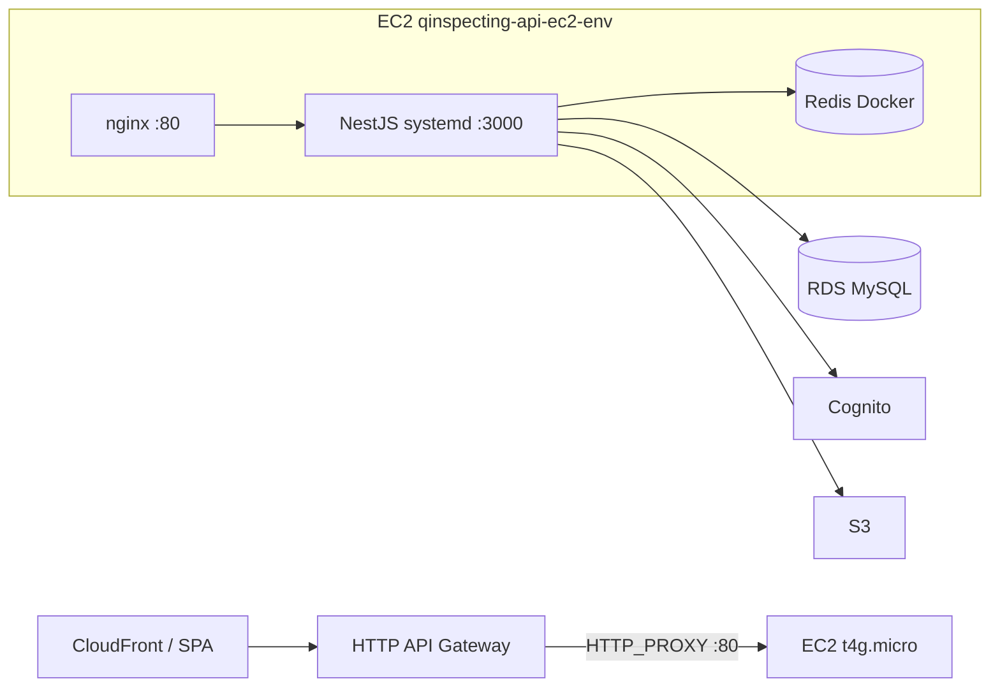

# API NestJS en EC2 (reemplazo de Lambda)

Desde 2026-06 el backend **qinspecting_api_nest** corre en **EC2 t4g.micro** con **systemd + nginx + Redis Docker**. La URL pública del frontend **no cambia**: sigue siendo API Gateway HTTP → proxy a la EC2.

Implementación y scripts: repositorio **`qinspecting_api_nest`** (`docs/DEPLOY_EC2.md`).

## Arquitectura



| Capa | Recurso AWS | Stack / script |
|------|-------------|----------------|
| Compute | EC2 `t4g.micro` + EIP | `qinspecting-api-ec2-{dev\|prod}` — `api-ec2.yaml` |
| Proxy | nginx → Nest :3000 | User-data + `deploy/nginx-qinspecting-api.conf` |
| Colas | Redis 7 (Docker local) | `qinspecting-redis.service` |
| URL pública | HTTP API Gateway | `man-qinspecting-backend-api-{dev\|prod}` — `http-api-ec2-proxy.yaml` |
| CI/CD | GitHub Actions SSH | `.github/workflows/deploy.yml` |

## URLs del frontend (`VITE_API_BASE_URL`)

| Entorno | URL (termina en `/api`) |
|---------|-------------------------|
| **dev** | `https://ed64jjgsc2.execute-api.us-east-1.amazonaws.com/dev/api` |
| **prod** | `https://7t60bih032.execute-api.us-east-1.amazonaws.com/prod/api` |

Health: `{base}/health/live`

## Stacks CloudFormation

| Stack | Estado | Contenido |
|-------|--------|-----------|
| `qinspecting-api-ec2-dev` | Desplegado | EC2 + SG + EIP + IAM instance profile |
| `qinspecting-api-ec2-prod` | Pendiente | Misma plantilla, `EnvironmentName=prod` |
| `man-qinspecting-backend-api-dev` | EC2 proxy | HTTP API `ed64jjgsc2`, sin Lambda |
| `man-qinspecting-backend-api-prod` | Lambda (migrar) | HTTP API `7t60bih032` → migrar con `migrate-prod-to-ec2.sh` |

**Eliminados / obsoletos (dev):**

- Lambda `man-qinspecting-backend-api-dev-handler`
- Pipeline `man-qinspecting-backend-cicd-dev` (CodeBuild/CodePipeline Lambda)
- Stack legacy `qinspecting-backend-api`

**Conservados (otros productos):**

- `qinspecting-api-AuthorizerFunction` — API legacy SAM (`qinspecting-api`)
- `qinspecting-api-flutter-v2-prod-*` — app Flutter legacy (`api_flutter_v2`)

## Red y seguridad

| Puerto | Origen | Destino |
|--------|--------|---------|
| 22 | Tu IP (`SSH_CIDR`) | EC2 API (administración) |
| 80 | `0.0.0.0/0` | EC2 API (API Gateway HTTP proxy) |
| 3306 | SG API EC2 | RDS MySQL (regla post-deploy en `deploy-api-ec2-infra.sh`) |

La EC2 está en subnet **pública** con EIP. RDS permanece en subnets privadas.

Valores por defecto de VPC/subnet: [BASTION.md](BASTION.md).

## Despliegue rápido (dev)

```bash
cd qinspecting_api_nest

# 1. Infra (una vez)
MY_IP=$(curl -s ifconfig.me)
SSH_CIDR=${MY_IP}/32 ./scripts/deploy-api-ec2-infra.sh dev

# 2. .env en la instancia (ver .env.ec2.example)

# 3. App
EC2_HOST=<eip> EC2_SSH_KEY=../microservices_strategies/qinspecting-bastion.pem ./scripts/deploy-api-ec2.sh

# 4. API Gateway (CloudFormation, sin Lambda)
./scripts/update-http-api-ec2-stack.sh dev <eip>
./scripts/sync-apigateway-cors.sh dev
```

## Migración prod

Checklist automatizado:

```bash
./scripts/migrate-prod-to-ec2.sh
./scripts/migrate-prod-to-ec2.sh --step 1   # infra
# ... pasos 2-7 ...
./scripts/migrate-prod-to-ec2.sh --step 8   # eliminar Lambda prod (tras validar)
```

## Coste vs Lambda

| Concepto | Lambda (antes) | EC2 (ahora) |
|----------|----------------|-------------|
| Compute API | Por invocación + límite 250 MB zip | ~USD 6–8/mes fijo (t4g.micro) |
| Redis BullMQ | N/A en Lambda liviano | Docker local ~$0 |
| API Gateway | Igual | Igual |

Ver también [OPTIMIZACION_COSTOS_AWS.md](OPTIMIZACION_COSTOS_AWS.md).

## Operación

```bash
# SSH
ssh -i qinspecting-bastion.pem ec2-user@<eip>

# Logs
sudo journalctl -u qinspecting-api -f
sudo systemctl status qinspecting-api qinspecting-redis nginx

# Health directo EC2
curl http://<eip>/api/health/live

# Health vía API Gateway
curl https://ed64jjgsc2.execute-api.us-east-1.amazonaws.com/dev/api/health/live
```
